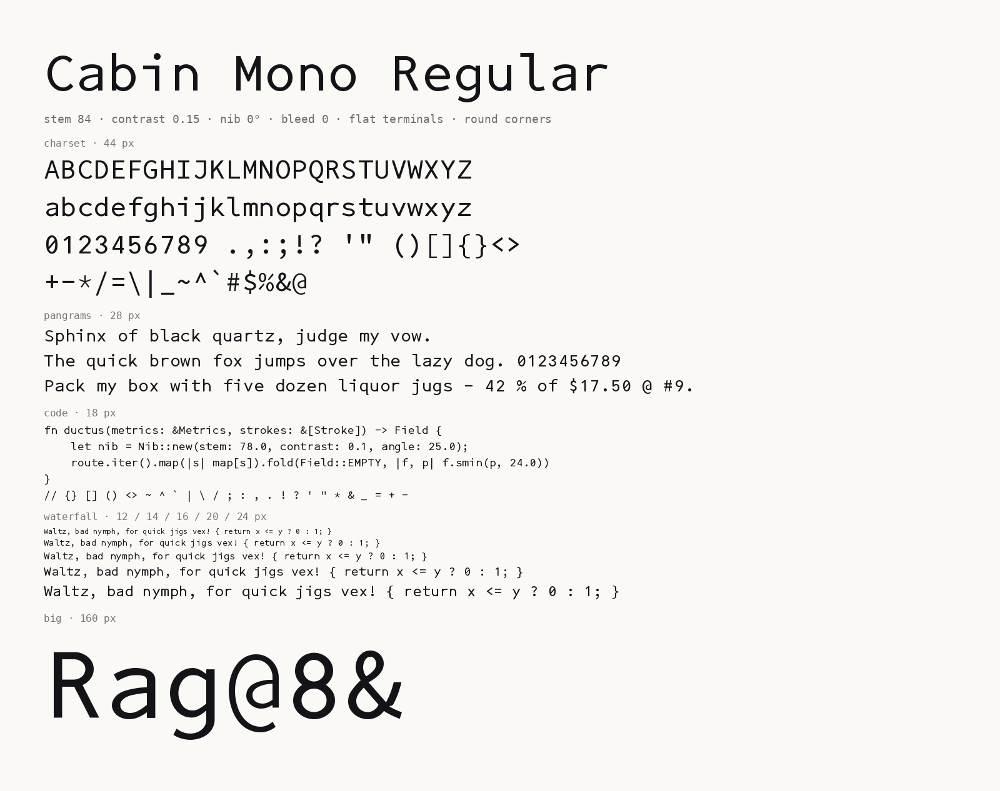
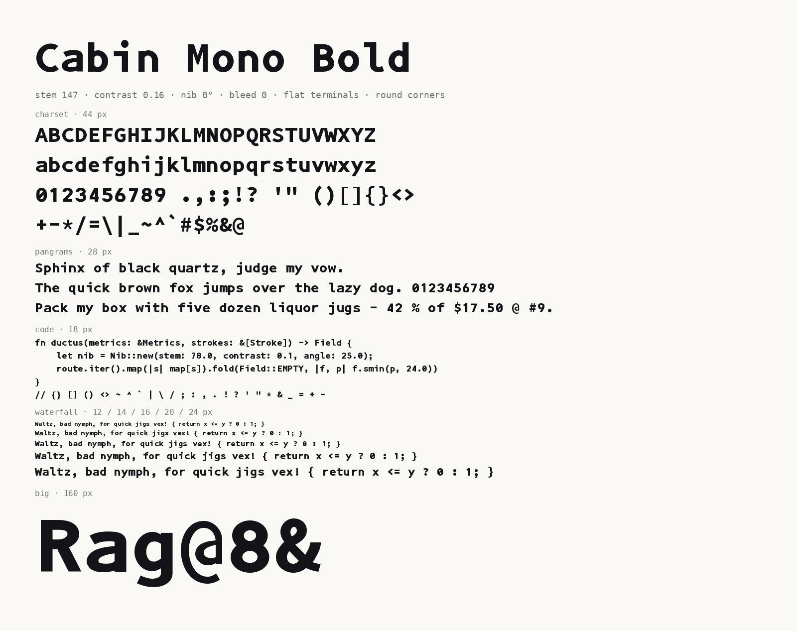

# Cabin Mono

A monospace font in the manner of Source Code Pro, with its own digits,
a single-storey g, and flatter tips. Regular and Bold.

## Files

| file | use |
|---|---|
| `fonts/CabinMono-Regular.ttf`, `fonts/CabinMono-Bold.ttf` | desktop, terminals, editors |
| `fonts/CabinMonoNerdFontMono-Regular.ttf`, `…-Bold.ttf` | the same with the [Nerd Fonts](https://www.nerdfonts.com/) icon set patched in (family "CabinMono Nerd Font Mono") |
| `fonts/CabinMono-Regular.woff2`, `fonts/CabinMono-Bold.woff2` | web |

Every release on the [releases page](../../releases) is a zip of all of the
above plus the license.

Stylistic sets: `ss01` double-storey g, `ss02` Source Code Pro's digits,
`ss03` single-storey a. Printable ASCII only.

## How it is made

The font is not drawn in a font editor. It is generated by
[ductus](https://github.com/faso/ductus), a program that draws letters as pen
strokes between named points in a text file. This repository holds only the
built files; the source of the letterforms lives with the generator.

Cabin Mono follows the proportions of
[Source Code Pro](https://github.com/adobe-fonts/source-code-pro) by Paul D.
Hunt (Adobe) and its digits follow shapes from
[Iosevka](https://github.com/be5invis/Iosevka). Both are their own works under
the SIL Open Font License; Cabin Mono's outlines were drawn from scratch.

## License

See [LICENSE](LICENSE).
